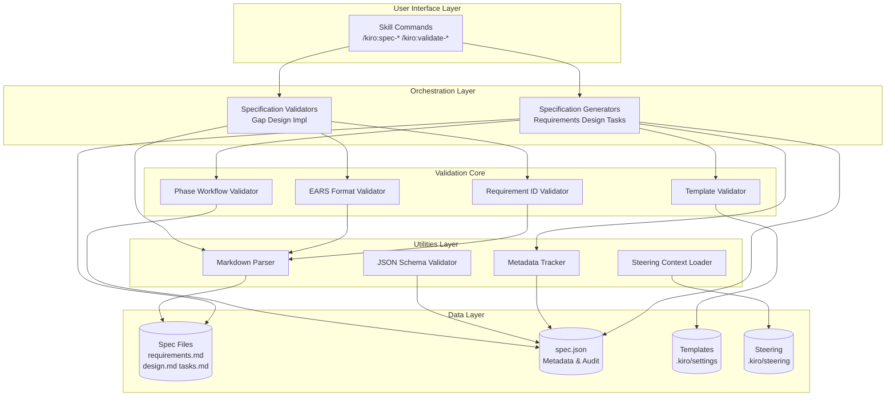
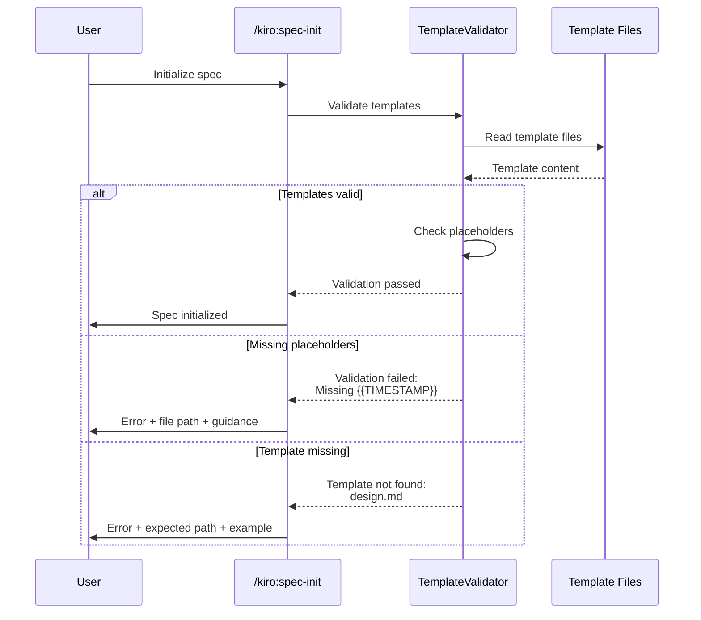
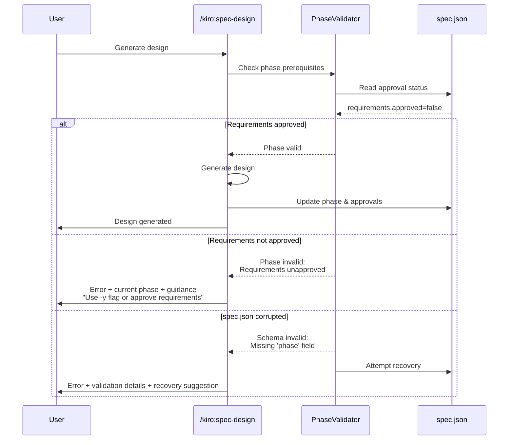
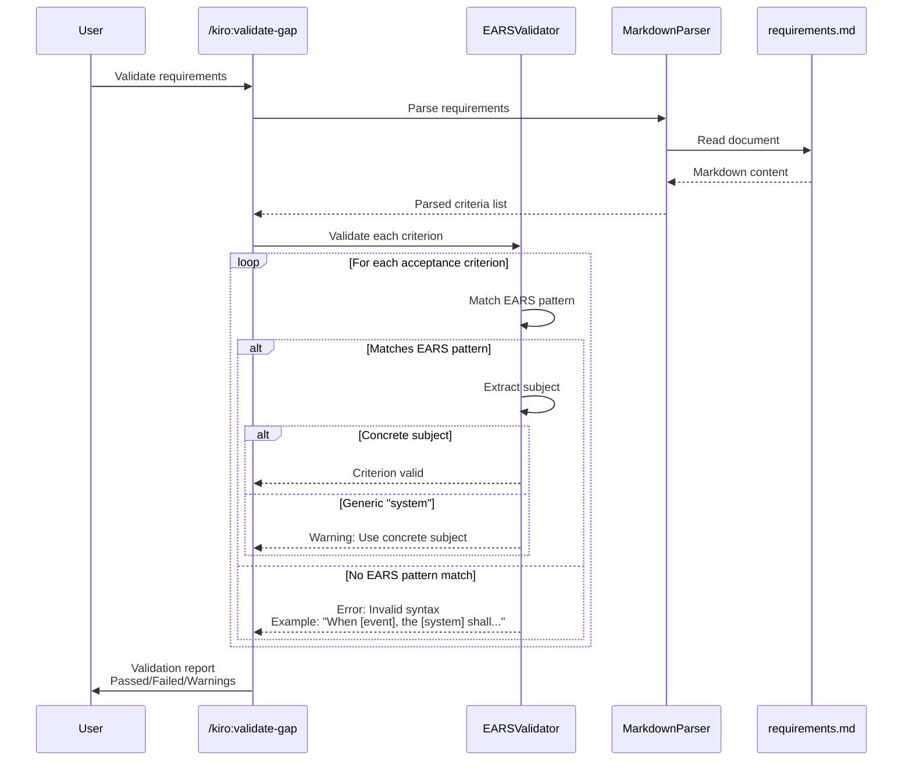

# Design Document

## Overview

This feature enhances the Kiro-style Spec-Driven Development (SDD) framework within Neutryx Core's AI Development Life Cycle by adding robust validation, comprehensive metadata tracking, and improved user feedback. The remediation transforms the current prompt-based validation approach into a hybrid architecture combining programmatic validation utilities with orchestrated AI workflows.

**Purpose**: Improve SDD framework reliability and usability through automated validation, enhanced error reporting, and comprehensive audit trails.

**Users**: Development teams using the SDD framework for feature specifications will benefit from stricter workflow enforcement, better error messages, and confidence that specifications meet quality standards.

**Impact**: Changes the current manual validation approach by introducing validation utilities that enforce template completeness, EARS format compliance, workflow phase gates, and requirement ID consistency while maintaining the familiar prompt-based workflow interface.

### Goals
- Automate validation of templates, EARS format, and workflow phases
- Provide clear, actionable error messages with remediation guidance
- Implement comprehensive metadata tracking and audit trails
- Maintain backward compatibility with existing specifications
- Enable optional gap analysis and design review capabilities

### Non-Goals
- Replacing the prompt-based workflow with CLI tools (hybrid approach preserves user experience)
- Validating implementation code quality (focus on specification quality)
- Auto-fixing validation errors (provide guidance, user makes corrections)
- Real-time validation during document editing (validation runs at workflow checkpoints)

## Architecture

### Existing Architecture Analysis

**Current SDD Framework**:
- Prompt-based workflow orchestrated through Claude Code skills (`/kiro:spec-*` commands)
- File-based specification storage in `.kiro/specs/{feature}/` directories
- Template-driven generation using `.kiro/settings/templates/specs/` files
- Rule-based guidance via `.kiro/settings/rules/` Markdown documents
- Manual validation enforced through AI prompt instructions
- Three-phase approval workflow: Requirements → Design → Tasks → Implementation

**Current Patterns to Preserve**:
- Markdown-based documentation format for requirements, design, tasks
- JSON metadata in `spec.json` for approval tracking
- Template placeholder syntax: `{{FEATURE_NAME}}`, `{{TIMESTAMP}}`, `{{PROJECT_DESCRIPTION}}`
- Skill command interface (`/kiro:spec-*` and `/kiro:validate-*`)
- Steering context loading from `.kiro/steering/` directory

**Integration Points**:
- Skill commands must read/write `.kiro/specs/{feature}/` files
- Validation utilities must parse existing Markdown and JSON formats
- Audit trail must extend existing `spec.json` schema
- Error reporting must integrate with skill command output format

### Architecture Pattern & Boundary Map



**Architecture Integration**:
- **Selected pattern**: Layered architecture with validation core and utility separation
- **Domain/feature boundaries**:
  - User Interface Layer: Skill command orchestration
  - Orchestration Layer: Generators and validators (existing workflow commands)
  - Validation Core: Specialized validators for each requirement category
  - Utilities Layer: Reusable parsing and tracking components
  - Data Layer: File system persistence (existing structure)
- **Existing patterns preserved**:
  - File-based specification storage
  - JSON metadata with approval tracking
  - Markdown documentation format
  - Template-driven generation
- **New components rationale**:
  - Validation Core: Enforces quality standards programmatically
  - Utilities Layer: Provides testable, reusable parsing and validation logic
  - Metadata Tracker: Centralized audit trail management
- **Steering compliance**: Follows modular architecture principles from `structure.md`, uses Python standard library per `tech.md`

### Technology Stack

| Layer | Choice / Version | Role in Feature | Notes |
|-------|------------------|-----------------|-------|
| Language | Python 3.10+ | Validation utilities | Aligns with Neutryx Core stack |
| Parsing | markdown 3.5+ | Markdown AST parsing | Standard library for requirements/design extraction |
| Validation | pydantic 2.6+ | JSON schema validation | Already in tech stack for config validation |
| File I/O | pathlib (stdlib) | File operations | Standard library, no new dependencies |
| Regex | re (stdlib) | EARS pattern matching | Standard library for pattern detection |

## System Flows

### Template Validation Flow



### Phase Validation Flow



### EARS Validation Flow



## Requirements Traceability

| Requirement | Summary | Components | Interfaces | Flows |
|-------------|---------|------------|------------|-------|
| 1.1, 1.2, 1.3, 1.4, 1.5 | Template Standardization | TemplateValidator | ValidationService | Template Validation Flow |
| 2.1, 2.2, 2.3, 2.4, 2.5 | Workflow Phase Validation | PhaseValidator | ValidationService | Phase Validation Flow |
| 3.1, 3.2, 3.3, 3.4, 3.5 | EARS Compliance | EARSValidator, MarkdownParser | ValidationService | EARS Validation Flow |
| 4.1, 4.2, 4.3, 4.4, 4.5 | Numeric ID Enforcement | RequirementIDValidator, MarkdownParser | ValidationService | - |
| 5.1, 5.2, 5.3, 5.4, 5.5 | Steering Context Loading | SteeringLoader | UtilityService | - |
| 6.1, 6.2, 6.3, 6.4, 6.5 | Gap Analysis | GapAnalyzer, MarkdownParser | ValidatorAPI | - |
| 7.1, 7.2, 7.3, 7.4, 7.5 | Design Validation | DesignValidator, MarkdownParser | ValidatorAPI | - |
| 8.1, 8.2, 8.3, 8.4, 8.5 | Task Dependency Analysis | TaskDependencyAnalyzer | UtilityService | - |
| 9.1, 9.2, 9.3, 9.4, 9.5 | Implementation Validation | ImplValidator, MarkdownParser | ValidatorAPI | - |
| 10.1, 10.2, 10.3, 10.4, 10.5 | Error Reporting | ErrorFormatter | All validators | All flows |
| 11.1, 11.2, 11.3, 11.4, 11.5 | Language Localization | LanguageHandler | UtilityService | - |
| 12.1, 12.2, 12.3, 12.4, 12.5 | Metadata Tracking | MetadataTracker, AuditLogger | MetadataService | All flows |

## Components and Interfaces

| Component | Domain/Layer | Intent | Req Coverage | Key Dependencies (P0/P1) | Contracts |
|-----------|--------------|--------|--------------|--------------------------|-----------|
| TemplateValidator | Validation Core | Validate template completeness | 1 | Templates (P0) | Service |
| PhaseValidator | Validation Core | Enforce workflow phase gates | 2 | spec.json (P0) | Service |
| EARSValidator | Validation Core | Validate EARS format compliance | 3 | MarkdownParser (P0) | Service |
| RequirementIDValidator | Validation Core | Enforce numeric requirement IDs | 4 | MarkdownParser (P0) | Service |
| SteeringLoader | Utilities Layer | Load steering context | 5 | File system (P0) | Service |
| GapAnalyzer | Orchestration Layer | Analyze implementation gaps | 6 | MarkdownParser (P0), Grep (P1) | API |
| DesignValidator | Orchestration Layer | Validate design quality | 7 | MarkdownParser (P0) | API |
| TaskDependencyAnalyzer | Utilities Layer | Analyze task dependencies | 8 | MarkdownParser (P0) | Service |
| ImplValidator | Orchestration Layer | Validate implementation | 9 | MarkdownParser (P0), Grep (P1) | API |
| ErrorFormatter | Utilities Layer | Format error messages | 10 | None | Service |
| LanguageHandler | Utilities Layer | Handle language localization | 11 | spec.json (P0) | Service |
| MetadataTracker | Utilities Layer | Track metadata and audit trail | 12 | spec.json (P0) | Service |
| MarkdownParser | Utilities Layer | Parse Markdown documents | 3, 4, 6, 7, 8, 9 | markdown library (P0) | Service |

### Validation Core

#### TemplateValidator

| Field | Detail |
|-------|--------|
| Intent | Validate template files contain required placeholders and structure |
| Requirements | 1.1, 1.2, 1.3, 1.4, 1.5 |

**Responsibilities & Constraints**
- Validate all template files in `.kiro/settings/templates/specs/` contain required placeholders
- Check placeholder naming consistency across templates
- Verify language field exists in templates
- Enforce template versioning when supported
- Boundary: Template file validation only, does not modify templates

**Dependencies**
- Inbound: SpecGenerator components (init, requirements, design, tasks) — template validation (P0)
- Outbound: Template files — read template content (P0)
- External: None

**Contracts**: Service [X]

##### Service Interface
```python
from typing import Dict, List, Optional
from pathlib import Path
from pydantic import BaseModel

class PlaceholderCheck(BaseModel):
    placeholder: str
    found: bool
    locations: List[int]  # Line numbers

class TemplateValidationResult(BaseModel):
    template_path: Path
    valid: bool
    required_placeholders: Dict[str, PlaceholderCheck]
    missing_placeholders: List[str]
    errors: List[str]
    warnings: List[str]

class TemplateValidator:
    """Validates template files for completeness and consistency."""

    REQUIRED_PLACEHOLDERS = [
        "{{FEATURE_NAME}}",
        "{{TIMESTAMP}}",
        "{{PROJECT_DESCRIPTION}}"
    ]

    def validate_template(
        self,
        template_path: Path
    ) -> TemplateValidationResult:
        """
        Validate a single template file.

        Preconditions:
        - template_path exists and is readable

        Postconditions:
        - Returns validation result with detailed placeholder analysis
        - Does not modify template file
        """
        ...

    def validate_all_templates(
        self,
        template_dir: Path
    ) -> Dict[str, TemplateValidationResult]:
        """
        Validate all template files in directory.

        Preconditions:
        - template_dir exists and is a directory

        Postconditions:
        - Returns map of template name to validation result
        - Does not modify any files
        """
        ...

    def check_placeholder_consistency(
        self,
        template_results: Dict[str, TemplateValidationResult]
    ) -> List[str]:
        """
        Check placeholder naming consistency across templates.

        Returns list of inconsistency warnings.
        """
        ...
```

**Implementation Notes**
- Integration: Called by all spec generation commands before template usage
- Validation: Use regex to detect placeholder patterns, check curly brace syntax
- Risks: Template format changes may require validator updates

#### PhaseValidator

| Field | Detail |
|-------|--------|
| Intent | Enforce workflow phase progression and approval gates |
| Requirements | 2.1, 2.2, 2.3, 2.4, 2.5 |

**Responsibilities & Constraints**
- Validate phase prerequisites before allowing phase transitions
- Enforce approval gates (requirements → design → tasks → implementation)
- Atomically update phase and approval state
- Detect and report spec.json corruption
- Boundary: Phase transition logic only, does not generate content

**Dependencies**
- Inbound: SpecGenerator and SpecValidator commands — phase checking (P0)
- Outbound: spec.json — read/write approval state (P0)
- External: None

**Contracts**: Service [X]

##### Service Interface
```python
from typing import Optional
from enum import Enum
from pydantic import BaseModel

class Phase(str, Enum):
    INITIALIZED = "initialized"
    REQUIREMENTS_GENERATED = "requirements-generated"
    DESIGN_GENERATED = "design-generated"
    TASKS_GENERATED = "tasks-generated"
    IMPLEMENTATION_IN_PROGRESS = "implementation-in-progress"
    IMPLEMENTATION_COMPLETE = "implementation-complete"

class PhaseCheckResult(BaseModel):
    can_proceed: bool
    current_phase: Phase
    required_approvals: List[str]  # e.g., ["requirements"]
    missing_approvals: List[str]
    errors: List[str]
    suggested_command: Optional[str]

class PhaseValidator:
    """Validates workflow phase transitions and approval gates."""

    def can_generate_design(
        self,
        spec_json_path: Path
    ) -> PhaseCheckResult:
        """
        Check if design generation is allowed.

        Preconditions:
        - spec_json_path exists

        Postconditions:
        - Returns whether design can be generated
        - Includes current phase and missing approvals
        """
        ...

    def can_generate_tasks(
        self,
        spec_json_path: Path
    ) -> PhaseCheckResult:
        """Check if task generation is allowed."""
        ...

    def can_start_implementation(
        self,
        spec_json_path: Path
    ) -> PhaseCheckResult:
        """Check if implementation can start."""
        ...

    def update_phase(
        self,
        spec_json_path: Path,
        new_phase: Phase,
        approvals_to_set: Dict[str, bool]
    ) -> None:
        """
        Atomically update phase and approval state.

        Preconditions:
        - spec_json_path exists and is writable
        - new_phase is valid transition from current phase

        Postconditions:
        - spec.json updated with new phase
        - Approval flags updated atomically
        - updated_at timestamp refreshed

        Raises:
        - ValueError if invalid phase transition
        - IOError if spec.json is corrupted
        """
        ...

    def validate_spec_json_schema(
        self,
        spec_json_path: Path
    ) -> List[str]:
        """
        Validate spec.json schema integrity.

        Returns list of validation errors (empty if valid).
        """
        ...
```

**Implementation Notes**
- Integration: Called at start of every spec generation command
- Validation: Read spec.json, check phase prerequisites, validate schema structure
- Risks: Must handle corrupted spec.json gracefully with recovery suggestions

#### EARSValidator

| Field | Detail |
|-------|--------|
| Intent | Validate acceptance criteria follow EARS format patterns |
| Requirements | 3.1, 3.2, 3.3, 3.4, 3.5 |

**Responsibilities & Constraints**
- Detect EARS patterns (Event, State, Unwanted, Optional, Ubiquitous) in acceptance criteria
- Extract and validate system/service subject names
- Provide pattern-specific correction suggestions
- Support manual override with user confirmation
- Boundary: EARS syntax validation only, does not assess requirement quality

**Dependencies**
- Inbound: GapAnalyzer, ImplValidator — EARS compliance checking (P0)
- Outbound: MarkdownParser — extract acceptance criteria (P0)
- Outbound: `.kiro/settings/rules/ears-format.md` — load examples (P1)
- External: None

**Contracts**: Service [X]

##### Service Interface
```python
from typing import List, Optional
from enum import Enum
from pydantic import BaseModel

class EARSPattern(str, Enum):
    EVENT = "event"  # When [event], the [system] shall
    STATE = "state"  # While [precondition], the [system] shall
    UNWANTED = "unwanted"  # If [trigger], the [system] shall
    OPTIONAL = "optional"  # Where [feature], the [system] shall
    UBIQUITOUS = "ubiquitous"  # The [system] shall
    COMBINED = "combined"  # Multiple patterns

class EARSValidationIssue(BaseModel):
    criterion_text: str
    line_number: int
    issue_type: str  # "no_pattern", "generic_subject", "ambiguous"
    detected_pattern: Optional[EARSPattern]
    subject: Optional[str]
    suggestion: str
    example: Optional[str]

class EARSValidationResult(BaseModel):
    total_criteria: int
    valid_criteria: int
    issues: List[EARSValidationIssue]
    warnings: List[str]

class EARSValidator:
    """Validates acceptance criteria follow EARS format patterns."""

    PATTERN_REGEXES = {
        EARSPattern.EVENT: r"When\s+\[.+?\],\s+the\s+\[?(\w+)\]?\s+shall",
        EARSPattern.STATE: r"While\s+\[.+?\],\s+the\s+\[?(\w+)\]?\s+shall",
        EARSPattern.UNWANTED: r"If\s+\[.+?\],\s+(?:then\s+)?the\s+\[?(\w+)\]?\s+shall",
        EARSPattern.OPTIONAL: r"Where\s+\[.+?\],\s+the\s+\[?(\w+)\]?\s+shall",
        EARSPattern.UBIQUITOUS: r"The\s+\[?(\w+)\]?\s+shall",
    }

    def validate_criterion(
        self,
        criterion_text: str,
        line_number: int
    ) -> Optional[EARSValidationIssue]:
        """
        Validate single acceptance criterion.

        Preconditions:
        - criterion_text is non-empty

        Postconditions:
        - Returns None if valid, issue details if invalid
        - Includes pattern detection and subject extraction
        """
        ...

    def validate_requirements_document(
        self,
        requirements_md_path: Path
    ) -> EARSValidationResult:
        """
        Validate all acceptance criteria in requirements.md.

        Preconditions:
        - requirements_md_path exists and is readable

        Postconditions:
        - Returns validation result with all issues
        - Does not modify requirements.md
        """
        ...

    def is_concrete_subject(
        self,
        subject: str,
        steering_context: Optional[Dict[str, str]] = None
    ) -> bool:
        """
        Check if subject is concrete (not generic "system").

        Uses steering context to validate against known system names.
        """
        ...

    def get_correction_example(
        self,
        issue: EARSValidationIssue
    ) -> str:
        """
        Get pattern-specific correction example from ears-format.md.

        Returns formatted example showing correct EARS syntax.
        """
        ...
```

**Implementation Notes**
- Integration: Called by validation commands and optionally during requirements generation
- Validation: Use regex patterns to detect EARS syntax, parse subject with capture groups
- Risks: Combined patterns may produce false negatives, manual override provides escape hatch

#### RequirementIDValidator

| Field | Detail |
|-------|--------|
| Intent | Enforce numeric requirement ID format and consistency |
| Requirements | 4.1, 4.2, 4.3, 4.4, 4.5 |

**Responsibilities & Constraints**
- Validate requirement headings use numeric IDs (not alphabetic)
- Detect missing IDs and auto-generate sequential numbering
- Prevent ID collisions across requirement updates
- Cross-reference IDs between requirements.md, design.md, and tasks.md
- Boundary: ID validation and normalization only, does not change requirement content

**Dependencies**
- Inbound: SpecGenerator (design, tasks) — ID validation (P0)
- Outbound: MarkdownParser — extract requirement headings (P0)
- External: None

**Contracts**: Service [X]

##### Service Interface
```python
from typing import List, Dict, Optional
from pydantic import BaseModel

class RequirementIDIssue(BaseModel):
    heading_text: str
    line_number: int
    issue_type: str  # "missing_id", "alphabetic_id", "duplicate_id"
    current_id: Optional[str]
    suggested_id: str

class RequirementIDValidationResult(BaseModel):
    total_requirements: int
    valid_ids: int
    issues: List[RequirementIDIssue]
    id_map: Dict[str, int]  # Old ID -> New ID for migrations

class RequirementIDValidator:
    """Validates and normalizes requirement ID format."""

    NUMERIC_ID_PATTERN = r"^(?:Requirement\s+)?(\d+)"
    ALPHABETIC_ID_PATTERN = r"^(?:Requirement\s+)?([A-Z])"

    def validate_requirements_ids(
        self,
        requirements_md_path: Path
    ) -> RequirementIDValidationResult:
        """
        Validate requirement ID format and consistency.

        Preconditions:
        - requirements_md_path exists

        Postconditions:
        - Returns validation result with issues and suggested IDs
        - Does not modify requirements.md
        """
        ...

    def normalize_alphabetic_ids(
        self,
        requirements_md_content: str
    ) -> tuple[str, Dict[str, str]]:
        """
        Convert alphabetic IDs to numeric IDs.

        Returns:
        - Updated content with numeric IDs
        - Mapping of old IDs to new IDs
        """
        ...

    def cross_reference_ids(
        self,
        requirements_md: Path,
        design_md: Optional[Path] = None,
        tasks_md: Optional[Path] = None
    ) -> List[str]:
        """
        Validate IDs referenced in design/tasks exist in requirements.

        Returns list of broken references (empty if all valid).
        """
        ...

    def detect_id_collisions(
        self,
        requirements_md_path: Path
    ) -> List[str]:
        """
        Detect duplicate requirement IDs.

        Returns list of duplicate IDs.
        """
        ...
```

**Implementation Notes**
- Integration: Called during requirements generation and when generating design/tasks
- Validation: Parse Markdown headings, extract IDs with regex, check uniqueness
- Risks: ID renumbering may break existing references in design/tasks documents

### Utilities Layer

#### MarkdownParser

| Field | Detail |
|-------|--------|
| Intent | Parse Markdown documents to extract structured data |
| Requirements | 3, 4, 6, 7, 8, 9 (cross-cutting) |

**Responsibilities & Constraints**
- Parse Markdown to AST for reliable extraction
- Extract requirement headings, IDs, and acceptance criteria
- Extract design components and interfaces
- Extract task hierarchies and dependencies
- Handle nested lists, code blocks, and tables correctly
- Boundary: Parsing only, does not validate content semantics

**Dependencies**
- Inbound: All validators — Markdown parsing (P0)
- Outbound: None
- External: markdown library 3.5+ (P0)

**Contracts**: Service [X]

##### Service Interface
```python
from typing import List, Dict, Optional
from pathlib import Path
from pydantic import BaseModel

class RequirementHeading(BaseModel):
    level: int  # Heading level (1-6)
    text: str
    numeric_id: Optional[int]
    line_number: int

class AcceptanceCriterion(BaseModel):
    text: str
    line_number: int
    requirement_id: Optional[int]

class TaskItem(BaseModel):
    task_id: str  # e.g., "1.1", "2.3"
    description: str
    details: List[str]
    requirements: List[str]  # Requirement IDs
    parallel: bool  # Has (P) marker
    line_number: int

class MarkdownParser:
    """Parse Markdown documents for SDD validation."""

    def parse_requirements(
        self,
        requirements_md_path: Path
    ) -> tuple[List[RequirementHeading], List[AcceptanceCriterion]]:
        """
        Extract requirement headings and acceptance criteria.

        Preconditions:
        - requirements_md_path exists and is valid Markdown

        Postconditions:
        - Returns all requirement headings with IDs
        - Returns all acceptance criteria with line numbers
        """
        ...

    def parse_tasks(
        self,
        tasks_md_path: Path
    ) -> List[TaskItem]:
        """
        Extract task hierarchy and metadata.

        Returns all tasks with IDs, descriptions, details, requirements.
        """
        ...

    def extract_code_blocks(
        self,
        md_content: str,
        language: Optional[str] = None
    ) -> List[str]:
        """
        Extract code blocks from Markdown content.

        Optionally filter by language identifier.
        """
        ...

    def extract_tables(
        self,
        md_content: str
    ) -> List[List[List[str]]]:
        """
        Extract tables from Markdown content.

        Returns list of tables, each table is list of rows.
        """
        ...
```

**Implementation Notes**
- Integration: Used by all validators for Markdown extraction
- Validation: Use `markdown` library's AST walker for robust parsing
- Risks: Markdown format variations may require parser updates

#### MetadataTracker

| Field | Detail |
|-------|--------|
| Intent | Track metadata and maintain audit trail in spec.json |
| Requirements | 12.1, 12.2, 12.3, 12.4, 12.5 |

**Responsibilities & Constraints**
- Update spec.json timestamps with ISO 8601 format
- Log phase transitions and approval events
- Record fast-track mode usage
- Maintain backward compatibility with existing spec.json files
- Boundary: Metadata management only, does not validate specification content

**Dependencies**
- Inbound: All spec generators and validators — metadata tracking (P0)
- Outbound: spec.json — read/write metadata (P0)
- External: None

**Contracts**: Service [X]

##### Service Interface
```python
from typing import Optional, List, Dict, Any
from datetime import datetime
from pathlib import Path
from pydantic import BaseModel
from enum import Enum

class AuditEventType(str, Enum):
    PHASE_TRANSITION = "phase_transition"
    APPROVAL_GRANTED = "approval_granted"
    VALIDATION_RUN = "validation_run"
    FAST_TRACK_USED = "fast_track_used"

class AuditEvent(BaseModel):
    timestamp: datetime
    event_type: AuditEventType
    details: Dict[str, Any]
    user: Optional[str] = None

class SpecMetadata(BaseModel):
    feature_name: str
    created_at: datetime
    updated_at: datetime
    language: str
    phase: str
    approvals: Dict[str, Dict[str, bool]]
    ready_for_implementation: bool
    schema_version: str = "1.0"
    audit_trail: List[AuditEvent] = []

class MetadataTracker:
    """Track metadata and audit trail for specifications."""

    def load_metadata(
        self,
        spec_json_path: Path
    ) -> SpecMetadata:
        """
        Load metadata from spec.json.

        Preconditions:
        - spec_json_path exists

        Postconditions:
        - Returns parsed metadata
        - Applies schema migration if needed
        """
        ...

    def save_metadata(
        self,
        spec_json_path: Path,
        metadata: SpecMetadata
    ) -> None:
        """
        Save metadata to spec.json.

        Preconditions:
        - spec_json_path is writable

        Postconditions:
        - spec.json updated with formatted JSON
        - updated_at timestamp refreshed
        """
        ...

    def log_phase_transition(
        self,
        metadata: SpecMetadata,
        old_phase: str,
        new_phase: str
    ) -> SpecMetadata:
        """
        Log phase transition event.

        Returns updated metadata with audit event.
        """
        ...

    def log_approval(
        self,
        metadata: SpecMetadata,
        approval_type: str,  # "requirements", "design", "tasks"
        approved: bool
    ) -> SpecMetadata:
        """
        Log approval grant event.

        Returns updated metadata with audit event.
        """
        ...

    def log_fast_track(
        self,
        metadata: SpecMetadata,
        command: str
    ) -> SpecMetadata:
        """
        Log fast-track mode usage.

        Returns updated metadata with audit event.
        """
        ...

    def migrate_schema(
        self,
        old_metadata: Dict[str, Any],
        target_version: str = "1.0"
    ) -> SpecMetadata:
        """
        Migrate old spec.json to current schema.

        Handles missing audit_trail and schema_version fields.
        """
        ...
```

**Implementation Notes**
- Integration: Called by all spec commands to update timestamps and log events
- Validation: Use pydantic for schema validation and migration
- Risks: Schema changes require careful migration logic to avoid breaking existing specs

#### ErrorFormatter

| Field | Detail |
|-------|--------|
| Intent | Format clear, actionable error messages with remediation guidance |
| Requirements | 10.1, 10.2, 10.3, 10.4, 10.5 |

**Responsibilities & Constraints**
- Format error messages with failure reason, file path, and remediation steps
- Provide before/after examples for validation failures
- Include help text with command syntax
- Display next recommended action on success
- Boundary: Message formatting only, does not handle error recovery logic

**Dependencies**
- Inbound: All validators — error message formatting (P0)
- Outbound: None
- External: None

**Contracts**: Service [X]

##### Service Interface
```python
from typing import Optional, List
from pydantic import BaseModel

class ErrorContext(BaseModel):
    failure_reason: str
    file_path: Optional[str]
    line_number: Optional[int]
    remediation_steps: List[str]
    before_example: Optional[str]
    after_example: Optional[str]
    help_text: Optional[str]
    next_command: Optional[str]

class ErrorFormatter:
    """Format clear, actionable error messages."""

    def format_validation_error(
        self,
        error_type: str,
        context: ErrorContext
    ) -> str:
        """
        Format validation error with context.

        Returns formatted Markdown error message.
        """
        ...

    def format_success_message(
        self,
        operation: str,
        result_summary: str,
        next_action: str
    ) -> str:
        """
        Format success message with next recommended action.

        Returns formatted Markdown success message.
        """
        ...

    def format_template_missing_error(
        self,
        template_path: str
    ) -> str:
        """
        Format error for missing template with example structure.

        Includes expected path and template example.
        """
        ...

    def format_phase_gate_error(
        self,
        current_phase: str,
        required_approvals: List[str],
        suggested_command: str
    ) -> str:
        """
        Format phase gate error with current status.

        Includes current phase, missing approvals, and guidance.
        """
        ...
```

**Implementation Notes**
- Integration: Called by all validators to format error output
- Validation: Consistent formatting across all error types
- Risks: None - pure formatting logic

#### SteeringLoader

| Field | Detail |
|-------|--------|
| Intent | Load and validate steering context files |
| Requirements | 5.1, 5.2, 5.3, 5.4, 5.5 |

**Responsibilities & Constraints**
- Load all files from `.kiro/steering/` recursively
- Validate default steering files exist
- Handle token budget limits with prioritization
- Warn when steering context is missing
- Boundary: Loading and validation only, does not interpret steering content

**Dependencies**
- Inbound: All spec generators — steering context loading (P0)
- Outbound: `.kiro/steering/` directory — read files (P0)
- External: None

**Contracts**: Service [X]

##### Service Interface
```python
from typing import Dict, List, Optional
from pathlib import Path
from pydantic import BaseModel

class SteeringFile(BaseModel):
    path: Path
    content: str
    modified_at: float  # Timestamp
    token_count: int

class SteeringContext(BaseModel):
    files: Dict[str, SteeringFile]
    total_tokens: int
    missing_defaults: List[str]
    warnings: List[str]

class SteeringLoader:
    """Load and validate steering context files."""

    DEFAULT_FILES = ["product.md", "tech.md", "structure.md"]

    def load_steering_context(
        self,
        steering_dir: Path,
        token_budget: Optional[int] = None
    ) -> SteeringContext:
        """
        Load all steering files recursively.

        Preconditions:
        - steering_dir exists

        Postconditions:
        - Returns steering context with all files
        - Prioritizes by modification timestamp if budget exceeded
        - Warns about missing default files
        """
        ...

    def validate_defaults_exist(
        self,
        steering_dir: Path
    ) -> List[str]:
        """
        Check default steering files exist.

        Returns list of missing default files.
        """
        ...

    def estimate_tokens(
        self,
        content: str
    ) -> int:
        """
        Estimate token count for content.

        Uses simple approximation: ~4 chars per token.
        """
        ...

    def prioritize_files(
        self,
        files: List[SteeringFile],
        token_budget: int
    ) -> List[SteeringFile]:
        """
        Prioritize files by modification time to fit budget.

        Returns list of files within token budget.
        """
        ...
```

**Implementation Notes**
- Integration: Called at start of all spec generation commands
- Validation: Check file existence, read content, estimate tokens
- Risks: Token estimation is approximate, may need refinement

### Orchestration Layer

#### GapAnalyzer

| Field | Detail |
|-------|--------|
| Intent | Analyze gap between requirements and existing codebase |
| Requirements | 6.1, 6.2, 6.3, 6.4, 6.5 |

**Responsibilities & Constraints**
- Compare approved requirements against existing code structure
- Identify existing components related to requirements
- Generate gap analysis report with integration points
- Recommend greenfield vs brownfield approach
- Save results to gap-analysis.md with timestamp
- Boundary: Analysis only, does not modify code or specifications

**Dependencies**
- Inbound: `/kiro:validate-gap` command — gap analysis (P0)
- Outbound: MarkdownParser — extract requirements (P0)
- Outbound: Grep/file search — find related code (P1)
- External: None

**Contracts**: API [X]

##### API Contract

| Method | Endpoint | Request | Response | Errors |
|--------|----------|---------|----------|--------|
| analyze_gap | `/kiro:validate-gap {feature}` | feature_name: str | GapAnalysisReport | 404 (requirements missing), 400 (requirements not approved) |

```python
from typing import List, Dict, Optional
from pathlib import Path
from pydantic import BaseModel

class ExistingComponent(BaseModel):
    path: Path
    component_name: str
    related_requirements: List[str]
    confidence: float  # 0.0-1.0

class GapAnalysisReport(BaseModel):
    feature_name: str
    timestamp: str
    existing_functionality: List[ExistingComponent]
    missing_functionality: List[str]  # Requirement IDs
    integration_points: List[str]
    recommended_approach: str  # "greenfield" or "brownfield"
    notes: List[str]

class GapAnalyzer:
    """Analyze implementation gap for requirements."""

    def analyze(
        self,
        feature_name: str,
        requirements_md: Path,
        codebase_root: Path
    ) -> GapAnalysisReport:
        """
        Analyze gap between requirements and existing code.

        Preconditions:
        - requirements_md exists and requirements are approved
        - codebase_root is valid directory

        Postconditions:
        - Returns gap analysis report
        - Saves report to .kiro/specs/{feature}/gap-analysis.md
        """
        ...

    def find_related_components(
        self,
        requirement_text: str,
        codebase_root: Path
    ) -> List[ExistingComponent]:
        """
        Find existing components related to requirement.

        Uses keyword matching and file path analysis.
        """
        ...
```

**Implementation Notes**
- Integration: Invoked via `/kiro:validate-gap {feature}` command
- Validation: Verify requirements approved, search codebase with grep/glob
- Risks: Keyword matching may produce false positives/negatives

#### DesignValidator

| Field | Detail |
|-------|--------|
| Intent | Validate design quality against architectural standards |
| Requirements | 7.1, 7.2, 7.3, 7.4, 7.5 |

**Responsibilities & Constraints**
- Evaluate design against criteria in design-review.md
- Check technology stack alignment with steering
- Validate structural compliance and testability
- Support interactive Q&A for design clarifications
- Update spec.json with review timestamp
- Boundary: Design quality validation only, does not modify design document

**Dependencies**
- Inbound: `/kiro:validate-design` command — design validation (P0)
- Outbound: MarkdownParser — extract design components (P0)
- Outbound: `.kiro/settings/rules/design-review.md` — load criteria (P0)
- Outbound: Steering files — check alignment (P1)
- External: None

**Contracts**: API [X]

##### API Contract

| Method | Endpoint | Request | Response | Errors |
|--------|----------|---------|----------|--------|
| validate_design | `/kiro:validate-design {feature}` | feature_name: str | DesignValidationReport | 404 (design missing), 400 (design not generated) |

```python
from typing import List, Dict, Optional
from pathlib import Path
from pydantic import BaseModel

class DesignIssue(BaseModel):
    category: str  # "technology", "structure", "testability", "performance", "security"
    severity: str  # "error", "warning", "info"
    description: str
    location: Optional[str]  # File location if applicable
    suggestion: str

class DesignValidationReport(BaseModel):
    feature_name: str
    timestamp: str
    passed: bool
    issues: List[DesignIssue]
    technology_alignment: bool
    structural_compliance: bool
    testability_adequate: bool
    performance_considered: bool
    security_addressed: bool

class DesignValidator:
    """Validate design quality against standards."""

    def validate(
        self,
        feature_name: str,
        design_md: Path,
        steering_context: SteeringContext
    ) -> DesignValidationReport:
        """
        Validate design against review criteria.

        Preconditions:
        - design_md exists and design is generated
        - steering_context loaded

        Postconditions:
        - Returns validation report with issues
        - Updates spec.json with review timestamp
        """
        ...

    def check_technology_alignment(
        self,
        design_content: str,
        steering_tech: str
    ) -> tuple[bool, List[DesignIssue]]:
        """
        Check technology stack aligns with steering.

        Returns alignment status and any issues.
        """
        ...
```

**Implementation Notes**
- Integration: Invoked via `/kiro:validate-design {feature}` command
- Validation: Parse design.md, compare against review criteria and steering
- Risks: Automated validation may miss nuanced design issues, interactive Q&A supplements

#### TaskDependencyAnalyzer

| Field | Detail |
|-------|--------|
| Intent | Analyze task dependencies and identify parallelization opportunities |
| Requirements | 8.1, 8.2, 8.3, 8.4, 8.5 |

**Responsibilities & Constraints**
- Analyze task dependencies based on file modifications
- Identify parallelizable tasks (no shared dependencies)
- Flag circular dependencies
- Generate task execution graph
- Include optimal execution order in tasks.md
- Boundary: Dependency analysis only, does not execute tasks

**Dependencies**
- Inbound: Task generation — dependency analysis (P0)
- Outbound: MarkdownParser — extract tasks (P0)
- Outbound: Design components — infer file dependencies (P1)
- External: None

**Contracts**: Service [X]

##### Service Interface
```python
from typing import List, Dict, Set, Optional
from pydantic import BaseModel

class TaskDependency(BaseModel):
    task_id: str
    depends_on: List[str]
    shared_files: Set[str]

class TaskGraph(BaseModel):
    tasks: List[TaskDependency]
    critical_path: List[str]
    parallel_tracks: List[List[str]]
    circular_dependencies: List[tuple[str, str]]

class TaskDependencyAnalyzer:
    """Analyze task dependencies for parallelization."""

    def analyze_dependencies(
        self,
        tasks: List[TaskItem],
        design_components: Optional[Dict[str, List[str]]] = None
    ) -> TaskGraph:
        """
        Analyze task dependencies.

        Preconditions:
        - tasks extracted from tasks.md
        - design_components map component to files (optional)

        Postconditions:
        - Returns task graph with dependencies
        - Identifies parallel tracks and critical path
        """
        ...

    def detect_circular_dependencies(
        self,
        dependencies: List[TaskDependency]
    ) -> List[tuple[str, str]]:
        """
        Detect circular dependencies.

        Returns list of circular dependency pairs.
        """
        ...

    def identify_parallel_tasks(
        self,
        dependencies: List[TaskDependency]
    ) -> List[List[str]]:
        """
        Identify tasks that can run in parallel.

        Returns groups of tasks with no shared dependencies.
        """
        ...
```

**Implementation Notes**
- Integration: Called during task generation to add (P) markers
- Validation: Infer file dependencies from task descriptions and design components
- Risks: Dependency inference may be imperfect, conservative approach safer

#### ImplValidator

| Field | Detail |
|-------|--------|
| Intent | Validate implementation against requirements and design |
| Requirements | 9.1, 9.2, 9.3, 9.4, 9.5 |

**Responsibilities & Constraints**
- Verify all requirements have implementation artifacts
- Validate implementation follows design patterns
- Report missing functionality with requirement references
- Check completed tasks have corresponding code changes
- Generate validation report with pass/fail per requirement
- Boundary: Validation only, does not modify implementation or specifications

**Dependencies**
- Inbound: `/kiro:validate-impl` command — implementation validation (P0)
- Outbound: MarkdownParser — extract requirements and tasks (P0)
- Outbound: Grep/file search — find implementation artifacts (P1)
- External: Git (optional) — check code changes (P2)

**Contracts**: API [X]

##### API Contract

| Method | Endpoint | Request | Response | Errors |
|--------|----------|---------|----------|--------|
| validate_impl | `/kiro:validate-impl {feature}` | feature_name: str | ImplValidationReport | 404 (spec missing), 400 (tasks not approved) |

```python
from typing import List, Dict, Optional
from pathlib import Path
from pydantic import BaseModel

class RequirementImplementationStatus(BaseModel):
    requirement_id: str
    requirement_summary: str
    implemented: bool
    artifacts: List[Path]
    missing_artifacts: List[str]

class ImplValidationReport(BaseModel):
    feature_name: str
    timestamp: str
    all_requirements_implemented: bool
    requirement_status: List[RequirementImplementationStatus]
    design_compliance_issues: List[str]
    incomplete_tasks: List[str]
    overall_pass: bool

class ImplValidator:
    """Validate implementation against specifications."""

    def validate(
        self,
        feature_name: str,
        requirements_md: Path,
        design_md: Path,
        tasks_md: Path,
        codebase_root: Path
    ) -> ImplValidationReport:
        """
        Validate implementation completeness.

        Preconditions:
        - All spec documents exist
        - Tasks are approved

        Postconditions:
        - Returns validation report with requirement status
        - Saves report to .kiro/specs/{feature}/impl-validation.md
        """
        ...

    def find_implementation_artifacts(
        self,
        requirement_text: str,
        codebase_root: Path
    ) -> List[Path]:
        """
        Find implementation artifacts for requirement.

        Uses keyword matching and file path analysis.
        """
        ...
```

**Implementation Notes**
- Integration: Invoked via `/kiro:validate-impl {feature}` command after implementation
- Validation: Search codebase for artifacts matching requirements, check task completion
- Risks: Artifact detection may miss implementations with different naming

#### LanguageHandler

| Field | Detail |
|-------|--------|
| Intent | Handle language localization for generated documents |
| Requirements | 11.1, 11.2, 11.3, 11.4, 11.5 |

**Responsibilities & Constraints**
- Read language setting from spec.json
- Localize content while preserving EARS keywords
- Validate localized content maintains Markdown structure
- Default to English if language undefined
- Boundary: Localization only, does not translate EARS keywords

**Dependencies**
- Inbound: All spec generators — language handling (P0)
- Outbound: spec.json — read language field (P0)
- External: None (manual localization, no translation API)

**Contracts**: Service [X]

##### Service Interface
```python
from typing import Optional
from pathlib import Path

class LanguageHandler:
    """Handle language localization for specs."""

    EARS_KEYWORDS = ["When", "If", "While", "Where", "shall"]

    def get_language(
        self,
        spec_json_path: Path
    ) -> str:
        """
        Get language setting from spec.json.

        Returns language code, defaults to "en" if undefined.
        """
        ...

    def should_localize(
        self,
        language: str
    ) -> bool:
        """
        Check if localization is needed.

        Returns False for "en", True for other languages.
        """
        ...

    def preserve_ears_keywords(
        self,
        content: str
    ) -> bool:
        """
        Validate content preserves EARS keywords.

        Returns True if keywords are in English.
        """
        ...
```

**Implementation Notes**
- Integration: Called by spec generators to determine language
- Validation: Currently manual localization, future enhancement could add translation API
- Risks: Manual localization may have inconsistencies

## Data Models

### Domain Model

**Specification Aggregate**:
- Root Entity: Specification (identified by feature_name)
- Value Objects: Phase, Approval, AuditEvent
- Domain Events: PhaseTransitioned, ApprovalGranted, ValidationCompleted
- Invariants:
  - Phase must progress sequentially (cannot skip phases)
  - Approvals must be granted before phase transitions
  - Audit trail is append-only

**Validation Result Aggregate**:
- Root Entity: ValidationResult (identified by validation_type and timestamp)
- Value Objects: ValidationIssue, ErrorContext
- No domain events (validation is stateless)

### Logical Data Model

**spec.json Structure**:
```json
{
  "feature_name": "string",
  "created_at": "ISO8601 datetime",
  "updated_at": "ISO8601 datetime",
  "language": "string (2-letter code)",
  "phase": "enum(initialized, requirements-generated, design-generated, tasks-generated, implementation-in-progress, implementation-complete)",
  "approvals": {
    "requirements": {
      "generated": "boolean",
      "approved": "boolean"
    },
    "design": {
      "generated": "boolean",
      "approved": "boolean"
    },
    "tasks": {
      "generated": "boolean",
      "approved": "boolean"
    }
  },
  "ready_for_implementation": "boolean",
  "schema_version": "string (default: 1.0)",
  "audit_trail": [
    {
      "timestamp": "ISO8601 datetime",
      "event_type": "enum(phase_transition, approval_granted, validation_run, fast_track_used)",
      "details": "object",
      "user": "string (optional)"
    }
  ]
}
```

**Consistency & Integrity**:
- Transaction boundaries: spec.json updates are atomic (file write)
- Cascading rules: Phase transitions cascade approval updates
- Temporal aspects: Audit trail maintains chronological order

### Data Contracts & Integration

**spec.json Schema Migration**:
- Old schema (no audit_trail) → New schema (with audit_trail)
- Migration adds empty audit_trail array if missing
- Migration adds schema_version "1.0" if missing
- Backward compatible: old fields preserved

**Validation Result Schemas**:
- All validation results use pydantic models for type safety
- Consistent error structure across all validators
- Serializable to JSON for potential future API exposure

## Error Handling

### Error Strategy

**Validation Errors** (user-fixable):
- Template validation failures → Report missing placeholders with line numbers
- EARS format errors → Show incorrect criterion with pattern example
- Phase gate violations → Display current phase and required approvals
- Requirement ID errors → Suggest normalized IDs with mapping

**System Errors** (infrastructure):
- spec.json corruption → Attempt recovery, suggest manual restoration
- Template file missing → Report expected path, provide example structure
- Markdown parsing errors → Report line number, suggest format fix

**Business Logic Errors**:
- Unapproved phase transition → Block operation, guide user to approval workflow
- Circular task dependencies → Flag cycles, suggest resolution
- Missing steering context → Warn user, proceed with degraded context

### Error Categories and Responses

**User Errors** (4xx equivalent):
- Invalid phase transition → Block operation, show phase status
- Unapproved prerequisites → Display required approvals, suggest `-y` flag
- Missing required files → Report expected paths, suggest generation commands

**System Errors** (5xx equivalent):
- spec.json corrupted → Attempt schema validation recovery
- File I/O failures → Report permissions or disk space issues
- Parsing failures → Report line numbers, suggest format corrections

**Business Logic Errors** (422 equivalent):
- EARS validation failed → Show non-compliant criteria with examples
- Requirement ID collision → List duplicate IDs, suggest renumbering
- Template incompleteness → Report missing placeholders, suggest fixes

### Monitoring

- Validation errors logged to console output
- Audit trail captures all validation runs with timestamps
- Future enhancement: Export validation metrics to observability system

## Testing Strategy

### Unit Tests
- TemplateValidator: Test placeholder detection, template versioning, consistency checks
- PhaseValidator: Test phase prerequisites, atomic updates, corruption recovery
- EARSValidator: Test all five EARS patterns, subject extraction, combined patterns
- RequirementIDValidator: Test numeric/alphabetic detection, normalization, collision detection
- MarkdownParser: Test heading extraction, acceptance criteria parsing, task parsing

### Integration Tests
- End-to-end spec generation: Initialize → Requirements → Design → Tasks
- Phase gate enforcement: Attempt design without approved requirements (should fail)
- EARS validation with real requirements.md: Parse and validate acceptance criteria
- Metadata tracking: Verify audit trail logged correctly across commands
- Steering context loading: Load multiple files, handle missing defaults

### E2E/UI Tests
- Full SDD workflow: Create spec, generate all phases, run validations
- Error message clarity: Trigger each error type, verify actionable messages
- Backward compatibility: Load old spec.json without audit_trail, verify migration

### Performance/Load
- Markdown parsing: Validate performance with large requirements documents (1000+ lines)
- Steering context: Load large steering directories (50+ files)
- Audit trail growth: Verify spec.json size with 100+ audit events

## Optional Sections

### Security Considerations

**Validation Input Security**:
- Markdown parsing uses `markdown` library (trusted, no code execution)
- Regex patterns use bounded quantifiers to prevent ReDoS attacks
- File path validation prevents directory traversal attacks

**Audit Trail Integrity**:
- Audit trail is append-only (no deletion or modification)
- Timestamps use UTC ISO 8601 format for consistency
- User field optional (no authentication in current scope)

**Template Security**:
- Template validation does not execute template content
- Placeholder patterns use simple regex (no eval or exec)

### Performance & Scalability

**Target Metrics**:
- Template validation: < 100ms for all templates
- EARS validation: < 1s for 100 acceptance criteria
- Markdown parsing: < 500ms for 1000-line documents
- Steering context loading: < 2s for 50 files

**Scaling Approaches**:
- Markdown parsing: Cache parsed AST for multiple validators
- Steering context: Lazy loading with token budget prioritization
- Validation results: In-memory only (no database overhead)

**Caching Strategies**:
- Template validation results cached per session
- Parsed Markdown AST cached for multiple validation passes
- Steering context cached after initial load

## Supporting References

None - all design details are self-contained in main sections.
